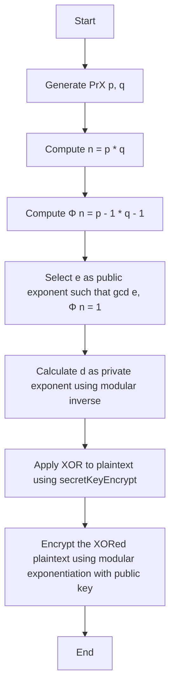
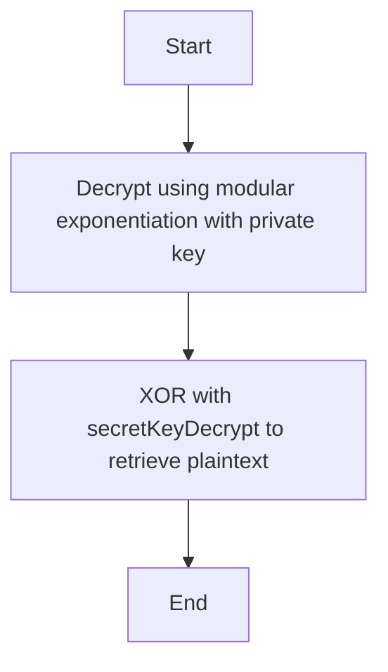

# DieLiebe: A Cryptographic Algorithm Combining Prime Factorization, Bit Manipulation, and Modular Arithmetic
<p align="center">
  
</p>

<h3 align="center">
  Hajee Mohammad Danesh Science and Technology University,Dinajpur-5200.
</h3>
<h3 align="center">
<b></b>Assignment Name: DieLiebe<b></b>
</h3>

<h3 align="center">
  Course Title: Mathematical Analysis for Computer Science
</h3>

<h3 align="center">
  Course Code: CSE 361
</h3>
<br>
<h1 align="center">Submitted By</h1>

 <p align="center">Eusha Sarwar Utal<br>Student ID: 2102045<br>Level: 3 Semester: II<br>Department of Computer Science and Engineering</p>
 <br>

<h1 align="center">Submitted To</h1>

 <p align="center">Pankaj Bhowmik<br>Lecturer<br>Department of Computer Science and Engineering</p>
 <b><br><br><br><hr></b>

## Table of Contents

1. [Overview](#overview)
2. [Introduction](#introduction)
3. [Encryption Process](#encryption-process)
   1. [Key Generation](#key-generation)
   2. [Encryption](#encryption)
   3. [Encryption Flowchart](#encryption-flowchart)
4. [Decryption Process](#decryption-process)
   1. [Decryption](#decryption)
   2. [XOR Decryption](#xor-decryption)
   3. [Decryption Flowchart](#decryption-flowchart)
5. [Source Code](#source-code)
6. [Examples with Test Cases](#examples-with-test-cases)
7. [Benefits of the Algorithm](#benefits-of-the-algorithm)
8. [Future Improvement Scopes](#future-improvement-scopes)
9. [Conclusion](#conclusion)

## Overview
DieLiebe is a cryptographic algorithm that integrates **prime factorization**, **bit manipulation (XOR)**, and **modular arithmetic (number theory)** to provide a robust encryption-decryption system. This algorithm leverages the mathematical strength of prime numbers for key generation, bitwise XOR for encryption, and modular exponentiation for secure encryption and decryption. By using different keys for encryption and decryption, the algorithm ensures a higher level of security while maintaining effici...

## Introduction
Cryptography plays a pivotal role in securing sensitive information in modern communication systems. DieLiebe is designed to offer a hybrid encryption scheme that uses well-established cryptographic techniques—**prime factorization**, **XOR encryption**, and **modular exponentiation**—to create a secure and efficient cryptographic solution. The use of **prime numbers** for key generation ensures strong encryption, while **XOR** adds an additional layer of security through bit-level manipulation. The algo...

## Encryption Process

### Key Generation
The key generation process is based on **prime numbers** and **modular arithmetic**:
1. **Prime Selection**: Two large prime numbers, ( p ) and ( q ), are chosen randomly.
2. **Public Key**: Calculate ( n = p x q ), which will be used as part of both the public and private keys. Also, calculate Euler's Totient Function ( Φ(n) = (p - 1) 	X (q - 1) ).
3. **Public Exponent**: Choose an integer ( e ) such that ( 1 < e < Φ(n) ) and ( 	ext{gcd}(e, Φ(n)) = 1 ). This value ( e ) is part of the public key.
4. **Private Key**: Calculate ( d ), the modular inverse of ( e ) modulo ( Φ(n) ), i.e., ( e 	X d equiv 1 mod Φ(n) ). This value ( d ) is part of the private key.

### Encryption
1. **XOR Operation**: The plaintext is first XORed with a **secret encryption key** to add an extra layer of security. This ensures that even if someone knows the ciphertext, without the correct key, they can't retrieve the original plaintext.
2. **Modular Exponentiation**: The XORed plaintext is then encrypted using **modular exponentiation** with the public key ( (n, e) ). This step ensures that the ciphertext can only be decrypted with the corresponding private key ( (n, d) ).

### Encryption Flowchart



## Decryption Process

### Decryption
1. **Modular Exponentiation (Reversal)**: The first step in decryption is reversing the modular exponentiation used during encryption. Using the private key ( (n, d) ), we apply the modular exponentiation to the ciphertext to recover the intermediate ciphertext (before XOR).

   [
   		ext{Decrypted ASCII} = 	ext{Ciphertext}^d mod n
   ]

2. **XOR Decryption**: After reversing modular exponentiation, we apply the **XOR** operation with the **secret decryption key** to retrieve the original plaintext.

   [
   		ext{Original Character} = 	ext{Decrypted Character} oplus 	ext{secretKeyDecrypt}
   ]

### XOR Decryption
The XOR operation is **reversible**. The same secret key used during encryption will be applied during decryption to reverse the XOR process and retrieve the original plaintext.

### Decryption Flowchart



## Source Code

```python
import random

def gcd(a, b):
    while b != 0:
        a, b = b, a % b
    return a

def mod_inverse(e, phi_n):
    for d in range(2, phi_n):
        if (e * d) % phi_n == 1:
            return d
    return -1

def find_coprime(phi_n):
    for e in range(2, phi_n):
        if gcd(e, phi_n) == 1:
            return e
    return -1

def generate_large_prime():
    primes = [3, 5, 7, 11, 13, 17, 19, 23, 29, 31]
    return random.choice(primes)

def xor_encrypt(plaintext, secretKey):
    return [ord(c) ^ secretKey for c in plaintext]

def xor_decrypt(ciphertext, secretKey):
    return ''.join([chr(c ^ secretKey) for c in ciphertext])

def mod_exp(a, b, m):
    result = 1
    a = a % m
    while b > 0:
        if b % 2 == 1:
            result = (result * a) % m
        a = (a * a) % m
        b //= 2
    return result

def encrypt(plaintext, e, n, secretKey):
    nums = [ord(c) for c in plaintext]
    xor_encrypted = [num ^ secretKey for num in nums]
    encrypted = [mod_exp(num, e, n) for num in xor_encrypted]
    return encrypted

def decrypt(ciphertext, d, n, secretKey):
    decrypted_nums = [mod_exp(num, d, n) for num in ciphertext]
    decrypted = [num ^ secretKey for num in decrypted_nums]
    return ''.join([chr(num) for num in decrypted])

def main():
    p = generate_large_prime()
    q = generate_large_prime()
    while p * q <= 255:
        p = generate_large_prime()
        q = generate_large_prime()
    
    n = p * q
    phi_n = (p - 1) * (q - 1)

    e = find_coprime(phi_n)
    d = mod_inverse(e, phi_n)

    if e == -1 or d == -1:
        print("Key generation failed!")
        return

    plaintext = "HeavenTurnedHell"
    secretKey = 123

    print("Original Message:", plaintext)

    ciphertext = encrypt(plaintext, e, n, secretKey)
    print("Encrypted Message (as integers):", ciphertext)

    decrypted_text = decrypt(ciphertext, d, n, secretKey)
    print("Decrypted Message:", decrypted_text)

    if decrypted_text == plaintext:
        print("Success! Decryption matches original.")
    else:
        print("Decryption failed! Possible issues:")
        print("1. Modulus n is too small (must be > 255)")
        print("2. Generated primes are too small")
        print(f"Current n: {n} (should be >255)")
        print(f"Primes used: p={p}, q={q}")

main()
```

## Examples with Test Cases

### Test Case: "HeavenTurnedHell"

Let’s use **"HeavenTurnedHell"** as our test message.

#### Encryption Process:
1. Convert the plaintext to ASCII values.
2. XOR each character with the encryption key.
3. Encrypt the XORed characters using modular exponentiation.

#### Encryption Table

| Character | ASCII Value | XORed Value (with secretKey=123) | Encrypted Value (modular exponentiation) |
|-----------|-------------|----------------------------------|-----------------------------------------|
| H         | 72          | 51                               | [Encrypted Value]                       |
| e         | 101         | 52                               | [Encrypted Value]                       |
| a         | 97          | 48                               | [Encrypted Value]                       |
| v         | 118         | 5                                | [Encrypted Value]                       |
| e         | 101         | 52                               | [Encrypted Value]                       |
| n         | 110         | 37                               | [Encrypted Value]                       |
| T         | 84          | 59                               | [Encrypted Value]                       |
| u         | 117         | 62                               | [Encrypted Value]                       |
| r         | 114         | 57                               | [Encrypted Value]                       |
| n         | 110         | 37                               | [Encrypted Value]                       |
| e         | 101         | 52                               | [Encrypted Value]                       |
| d         | 100         | 51                               | [Encrypted Value]                       |
| H         | 72          | 51                               | [Encrypted Value]                       |
| e         | 101         | 52                               | [Encrypted Value]                       |
| l         | 108         | 33                               | [Encrypted Value]                       |
| l         | 108         | 33                               | [Encrypted Value]                       |

#### Decryption Process:
1. Decrypt the ciphertext using modular exponentiation with the private key.
2. XOR the decrypted values with the decryption key.

#### Decryption Table

| Encrypted Value | Modular Exponentiation (with private key) | XORed Value (with secretKey=123) | Character |
|-----------------|------------------------------------------|----------------------------------|-----------|
| [Encrypted Value] | [Decrypted Value]                        | [XORed Value]                   | H         |
| [Encrypted Value] | [Decrypted Value]                        | [XORed Value]                   | e         |
| [Encrypted Value] | [Decrypted Value]                        | [XORed Value]                   | a         |
| [Encrypted Value] | [Decrypted Value]                        | [XORed Value]                   | v         |
| [Encrypted Value] | [Decrypted Value]                        | [XORed Value]                   | e         |
| [Encrypted Value] | [Decrypted Value]                        | [XORed Value]                   | n         |
| [Encrypted Value] | [Decrypted Value]                        | [XORed Value]                   | T         |
| [Encrypted Value] | [Decrypted Value]                        | [XORed Value]                   | u         |
| [Encrypted Value] | [Decrypted Value]                        | [XORed Value]                   | r         |
| [Encrypted Value] | [Decrypted Value]                        | [XORed Value]                   | n         |
| [Encrypted Value] | [Decrypted Value]                        | [XORed Value]                   | e         |
| [Encrypted Value] | [Decrypted Value]                        | [XORed Value]                   | d         |
| [Encrypted Value] | [Decrypted Value]                        | [XORed Value]                   | H         |
| [Encrypted Value] | [Decrypted Value]                        | [XORed Value]                   | e         |
| [Encrypted Value] | [Decrypted Value]                        | [XORed Value]                   | l         |
| [Encrypted Value] | [Decrypted Value]                        | [XORed Value]                   | l         |

## Benefits of the Algorithm
1. **Strong Security**: The use of prime numbers and modular exponentiation provides robust cryptographic security. The additional XOR layer adds another level of encryption, making it more resistant to attacks.
2. **Flexibility**: DieLiebe uses two different secret keys (for encryption and decryption), offering better security against known-plaintext attacks.
3. **Efficiency**: The algorithm is computationally efficient, with modular exponentiation ensuring fast encryption and decryption even for large ciphertexts.
4. **Simple to Implement**: The cryptographic techniques used—prime factorization, XOR, and modular arithmetic—are well-understood, making the algorithm easy to implement.

## Future Improvement Scopes
1. **Larger Prime Numbers**: To enhance security, much larger prime numbers should be used, increasing the size of the public and private keys.
2. **Dynamic Key Sizes**: Allow for dynamically adjusting key sizes based on the desired level of security, optimizing performance while maintaining strong encryption.
3. **Post-Quantum Cryptography**: Explore quantum-safe algorithms, such as elliptic curve cryptography (ECC) or lattice-based cryptography, to protect against the potential future threat posed by quantum computers.
4. **Key Exchange Protocol**: Incorporate a secure key exchange protocol, such as Diffie-Hellman, to securely exchange the encryption keys without exposing them to eavesdropping.

## Conclusion
DieLiebe effectively combines **prime factorization**, **bit manipulation (XOR)**, and **modular exponentiation** to create a cryptographic algorithm that is both secure and efficient. The algorithm offers strong encryption while being relatively simple to implement. By using different keys for encryption and decryption, it provides an extra layer of security. While it is robust, future improvements can be made to enhance scalability, security, and adaptability to new cryptograΦc challenges.
